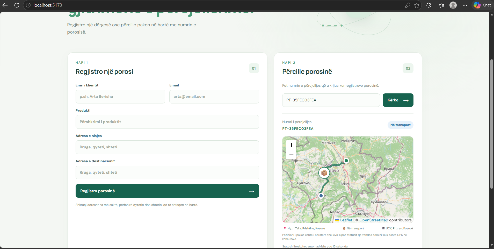
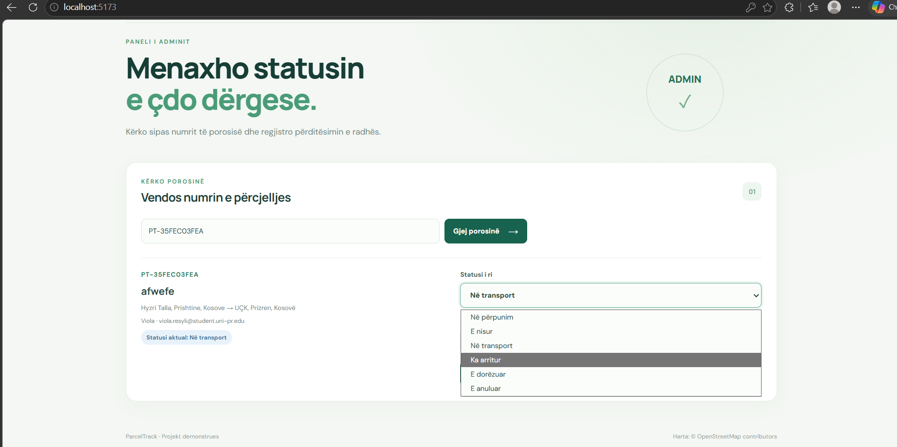

# ParcelTrack

Aplikacion demonstrues për regjistrimin dhe përcjelljen e porosive. Klientët mund të regjistrojnë dhe kërkojnë porosi, ndërsa administratori mund të përditësojë statusin e tyre.

## Pamjet e aplikacionit

### Pamja e klientit


### Pamja e administratorit


## Teknologjitë

- React, TypeScript dhe Vite
- ASP.NET Core Web API
- OpenStreetMap për gjetjen e adresave dhe shfaqjen e hartës

## Si të niset projekti

Kërkohen .NET 10 dhe Node.js.

1. Në `frontend/src/api.ts`, sigurohu që adresa e API-së është:

   ```ts
   const API = import.meta.env.VITE_API_URL ?? 'http://localhost:5169'